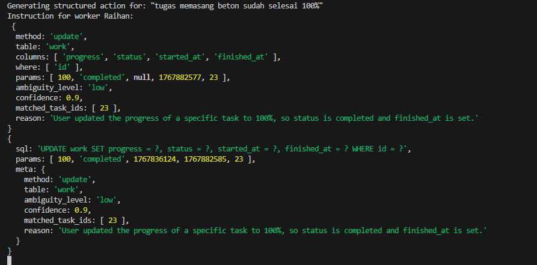
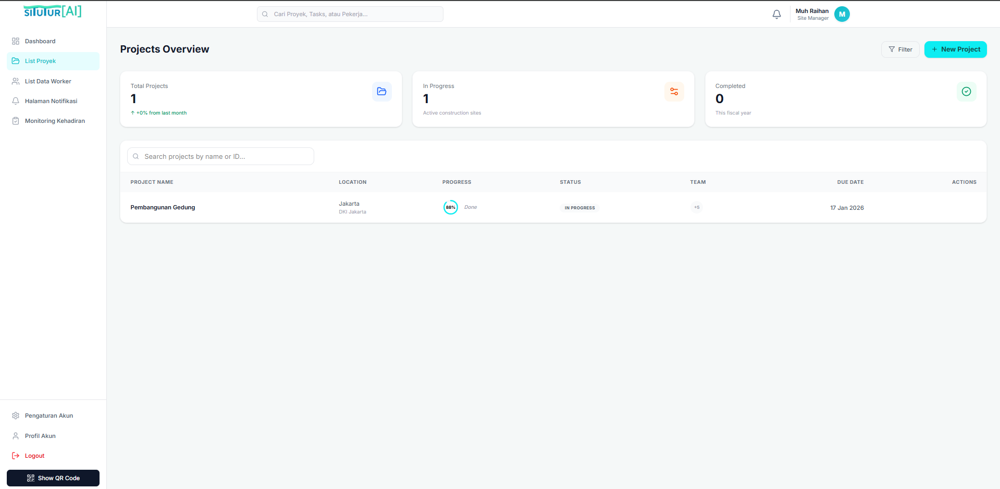
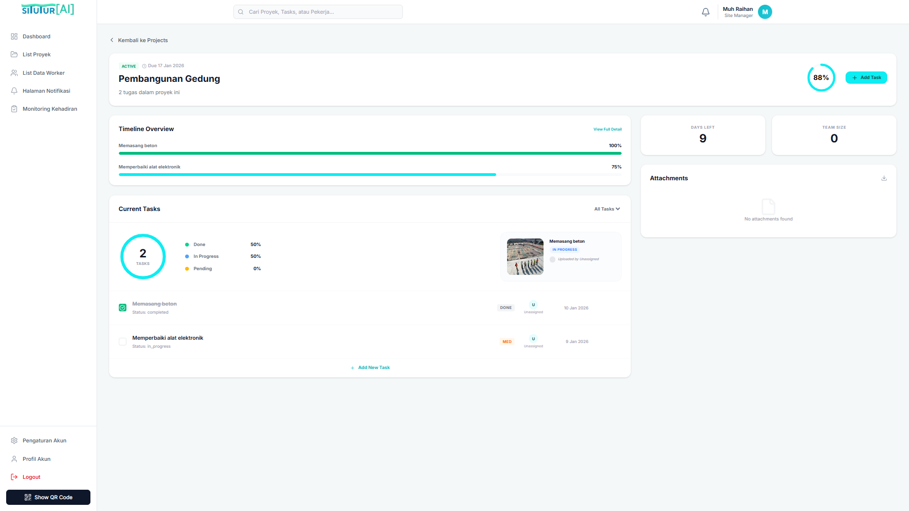
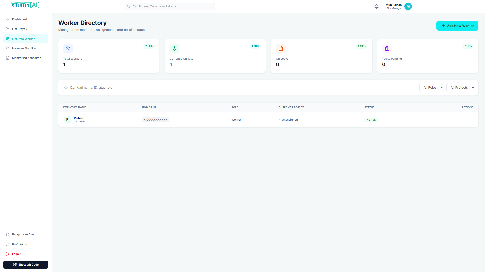
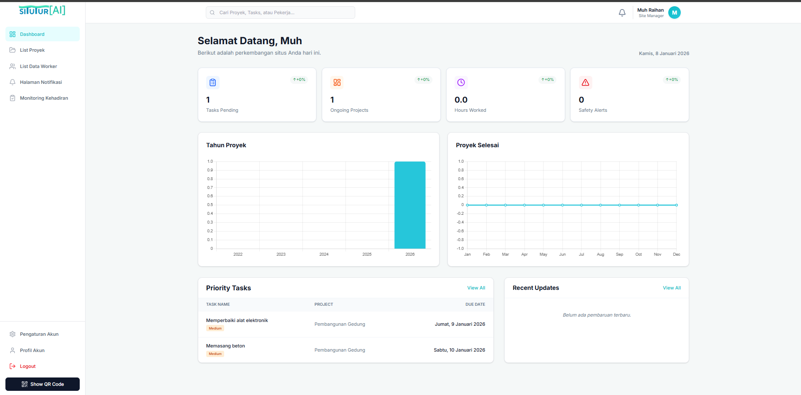

# 🏗️ Situtur AI - AI-Powered Construction Management System

<div align="center">


[](https://opensource.org/licenses/MIT)
[](https://nodejs.org/)
[](https://reactjs.org/)
[](https://expressjs.com/)

**Revolutionizing construction site management with AI-powered automation and WhatsApp integration**

[Features](#-features) • [Installation](#-installation) • [Architecture](#-architecture) • [Usage](#-usage) • [API Docs](#-api-documentation)

</div>

---

## 🌟 What is Situtur AI?

Situtur AI is a next-generation **construction management system** that leverages **artificial intelligence** and **WhatsApp integration** to streamline project workflows, automate task updates, and enhance team collaboration. Built for modern construction sites, it transforms natural language commands from workers into structured database operations—all through WhatsApp.

### 💡 The Problem We Solve

Traditional construction management systems require:
- ⏰ Manual data entry that wastes precious time
- 📱 Complex interfaces that confuse on-site workers
- 🔄 Constant context-switching between apps
- 📊 Disconnected communication channels

### ✨ Our Solution

Situtur AI brings:
- 🤖 **AI-powered task management** - Workers update progress via natural WhatsApp messages
- 📲 **Zero learning curve** - Familiar WhatsApp interface for everyone
- 🔄 **Real-time synchronization** - Instant updates across web dashboard and mobile
- 🎯 **Smart automation** - AI interprets commands and executes database operations
- 📈 **Analytics & insights** - Comprehensive dashboards with charts and metrics

---

## 🚀 Features

### 🤖 AI-Powered Automation
- **Natural Language Processing**: Workers can update tasks using conversational messages like "I finished the foundation work" or "Update progress to 75%"
- **Smart Command Interpretation**: Powered by Google Generative AI to understand context and intent
- **Automatic Validation**: AI detects ambiguous requests and adds them to approval queue

### 📱 WhatsApp Integration
- **QR Code Authentication**: Seamless WhatsApp Web integration
- **Real-time Updates**: Workers receive and send updates directly through WhatsApp
- **No App Installation**: Works with existing WhatsApp on any device
- **Broadcast Notifications**: Automatic updates to team members

### 📊 Comprehensive Dashboard
- **Project Overview**: Visual charts showing project progress and timelines
- **Task Management**: Drag-and-drop task organization with status tracking
- **Worker Management**: Monitor team performance and task assignments
- **Analytics**: Detailed insights with Chart.js visualizations

### 🔐 Security & Access Control
- **JWT Authentication**: Secure token-based authentication
- **Role-based Access**: Admin and User roles with different permissions
- **Audit Logging**: Complete history of all system changes
- **Signed Cookies**: Protected session management

### 📈 Advanced Features
- **Rate Limiting**: API protection with configurable limits
- **Pagination**: Efficient data loading for large datasets
- **OpenAPI Documentation**: Auto-generated API docs with Swagger UI
- **Transaction Support**: Database consistency with ACID transactions

---

## 🛠️ Installation

### Prerequisites

Before you begin, ensure you have the following installed:
- **Node.js** (v16.0.0 or higher)
- **MySQL/MariaDB** (v8.0 or higher)
- **npm** or **yarn**
- **Google AI API Key** ([Get it here](https://aistudio.google.com/app/api-keys))

### 📦 Step 1: Clone the Repository

```bash
git clone https://github.com/MuhRaihan001/situtur-ai.git
cd situtur-ai
```

### 🔧 Step 2: Install Dependencies

```bash
# Install backend dependencies
npm install

# Install frontend dependencies
cd frontend
npm install
cd ..
```

### 🗄️ Step 3: Database Setup

1. **Create a MySQL database**:
```sql
CREATE DATABASE situtur1;
```

2. **Import the database schema**:
```bash
mysql -u your_username -p situtur1 < database/situtur1.sql
```

### ⚙️ Step 4: Environment Configuration

Create a `.env` file in the root directory:

```bash
# SERVER
PORT=3000

# AI Configuration
KEY=your_google_ai_api_key
MODEL_NAME=gemini-pro

# WhatsApp Command Prefix
PREFIX=!

# Database Configuration
DATABASE_HOST=localhost
DATABASE_USER=your_db_user
DATABASE_PASSWORD=your_db_password
DATABASE_NAME=situtur1

# Security
SECRET_KEY=your_secret_key_here
```

**🔑 Important**: Replace `your_google_ai_api_key` with your actual Google AI API key.

### 🏗️ Step 5: Build Frontend

```bash
cd frontend
npm run build
cd ..
```

### 🚀 Step 6: Start the Application

```bash
# Using npm
npm start

# Or using the provided script
chmod +x run.sh
./run.sh
```

The application will be available at:
- 🌐 **Web Interface**: http://localhost:3000
- 📚 **API Documentation**: http://localhost:3000/api-docs

### 📱 Step 7: Connect WhatsApp

1. Navigate to the dashboard
2. Click on "Show QR Code" in the sidebar
3. Scan the QR code with WhatsApp on your phone
4. Once connected, workers can start sending commands!

---

## 🏗️ Architecture

### System Pipeline

```
┌─────────────────┐
│  Worker via WA  │ 
│  "Task done"    │
└────────┬────────┘
         │
         ▼
┌─────────────────────────┐
│  WhatsApp Client        │
│  (whatsapp-web.js)      │
└────────┬────────────────┘
         │
         ▼
┌─────────────────────────┐
│  AI Instructor          │
│  (Google Generative AI) │
│  Parses natural language│
└────────┬────────────────┘
         │
         ▼
┌─────────────────────────┐
│  Validation Layer       │
│  Checks ambiguity &     │
│  confidence             │
└────┬────────────┬───────┘
     │            │
     │ High       │ Low
     │ confidence │ confidence
     ▼            ▼
┌─────────┐  ┌──────────────┐
│ Execute │  │ Wait List    │
│ Action  │  │ (Approval)   │
└────┬────┘  └──────┬───────┘
     │              │
     │              ▼
     │       ┌──────────────┐
     │       │ Admin Review │
     │       └──────┬───────┘
     │              │
     └──────────────┘
              │
              ▼
     ┌─────────────────┐
     │ Database Update │
     │ + Audit Log     │
     └────────┬────────┘
              │
              ▼
     ┌─────────────────┐
     │ Dashboard       │
     │ Real-time UI    │
     └─────────────────┘
```

### Technology Stack

#### Backend
- **Runtime**: Node.js + Express.js
- **AI Engine**: Google Generative AI (Gemini)
- **Database**: MySQL with connection pooling
- **WhatsApp**: whatsapp-web.js
- **Authentication**: JWT (jose) + signed cookies
- **API Docs**: Swagger UI + OpenAPI 3.0

#### Frontend
- **Framework**: React 18 with Vite
- **Routing**: React Router DOM
- **Styling**: Tailwind CSS 4.0
- **Charts**: Chart.js + react-chartjs-2
- **Icons**: Lucide React
- **HTTP Client**: Axios

#### Security & Performance
- **Rate Limiting**: express-rate-limit
- **Security Headers**: Helmet.js
- **Password Hashing**: SHA-256
- **Session Management**: express-session
- **CORS**: Configurable CORS policies

---

## 📖 Usage

### For Workers (via WhatsApp)

Workers can interact with the system using natural language:

```
✅ "I've completed the foundation work"
✅ "Update my task progress to 80%"
✅ "Mark the concrete pouring as done"
✅ "I'm starting the electrical wiring"
```


The AI will:
1. Parse the message
2. Identify the task
3. Update the database
4. Send confirmation




### For Managers (via Dashboard)

**Project Management**:
- Create and manage multiple projects
- Set deadlines and milestones
- Track overall progress with visual charts



**Task Management**:
- Add tasks to projects
- Assign workers to specific tasks
- Monitor real-time progress updates
- View task history and audit logs



**Worker Management**:
- Add workers with WhatsApp numbers
- Assign tasks and track performance
- View worker statistics and completed tasks



**Analytics**:
- Project completion trends
- Worker performance metrics
- Monthly progress reports
- Safety alerts and notifications



---

## 📡 API Documentation

The API is fully documented using OpenAPI 3.0 specification. Access the interactive documentation at:

**http://localhost:3000/api-docs**

### Key Endpoints

#### Authentication
```
POST /login       - User login
POST /register    - New user registration
POST /logout      - User logout
```

#### Projects
```
GET    /user/List_Projek       - List all projects
POST   /user/List_Projek       - Create new project
PUT    /user/List_Projek       - Update project
DELETE /user/List_Projek       - Delete project
```

#### Tasks
```
GET    /works/list             - List all tasks
POST   /works/add              - Create new task
PUT    /works/update           - Update task
DELETE /works/delete           - Delete task
```

#### Workers
```
GET    /workers/list           - List all workers
POST   /workers/add            - Add new worker
PUT    /workers/update         - Update worker info
DELETE /workers/delete         - Remove worker
```

### Rate Limits
- Default: 100 requests per minute per IP
- Configurable per endpoint
- Returns `429` when exceeded

---

## 🎯 Key Highlights

### AI-Powered Intelligence
The system uses a sophisticated AI instruction model that:
- Converts natural language to structured database operations
- Validates data integrity before execution
- Detects ambiguous commands and routes them for approval
- Learns from context (e.g., worker's current task)

### WhatsApp Integration Benefits
- **100% Mobile-first**: Workers don't need to learn new software
- **Offline-capable**: Messages queue when offline
- **Multimedia support**: Workers can send photos of progress
- **Group broadcasts**: Instant team-wide notifications

### Automatic Project Stats
The system automatically calculates:
- Project completion percentage based on task progress
- Estimated completion dates using AI predictions
- Worker productivity metrics
- Resource allocation efficiency

### Enterprise-Grade Security
- All passwords hashed with SHA-256
- JWT tokens with expiration
- Role-based access control (RBAC)
- Complete audit trails for compliance
- SQL injection protection via parameterized queries

---

## 📄 License

This project is licensed under the MIT License - see the [LICENSE](LICENSE) file for details.

---

## 🙏 Acknowledgments

- **Google Generative AI** for powering our AI capabilities
- **whatsapp-web.js** for WhatsApp integration
- **React & Tailwind** communities for excellent UI tools
- All contributors who help improve this project

---

## 📞 Support

Having issues? We're here to help!

- 🐛 Issues: [GitHub Issues](https://github.com/MuhRaihan001/situtur-ai/issues)
- 💬 Discussions: [GitHub Discussions](https://github.com/MuhRaihan001/situtur-ai/discussions)